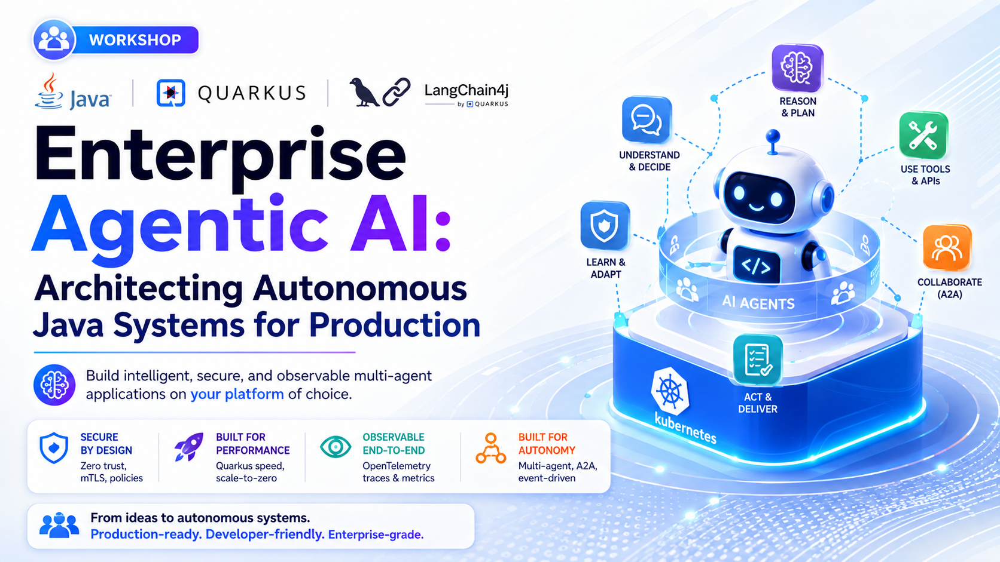

[](https://github.com/danieloh30/agentic-ai-java-workshop/actions/workflows/docs.yml)

# Enterprise Agentic AI: Architecting Autonomous Java Systems for Production

**Hands-On Workshop**  
**Part 1:** 90 minutes (10 min intro · 80 min hands-on), plus an optional 15-minute bonus<br>
**Part 2:** 80 minutes (four 20-minute exercises)<br>
**Lab site:** https://danieloh30.github.io/agentic-ai-java-workshop/ (short URL: [bit.ly/agents-labs](https://bit.ly/agents-labs))  
**Intro deck:** [intro-deck.pdf](docs/images/intro-deck.pdf)

Build an agentic incident management platform for **Apex Systems**, a fictional enterprise IT services company, using **Quarkus**, **Quarkus LangChain4j**, and **OpenCode CLI** or another AI coding assistant. Part 1 introduces agents, tools, orchestration, governance, and observability. Part 2 extends those foundations with planning, conversational memory, consensus voting, and event-driven processing.

## Learning path

### Part 1 — Fundamental patterns

Exercises 1–7 take you from a single agent and tool to parallel workflows, a supervisor, AI governance, human-in-the-loop approval, OpenTelemetry tracing, and remote agents over A2A. Exercise 8 is an optional bonus: generate and refine a post-incident report in a quality loop.

| Exercise and guide | What you will build and verify | Working project | Reference solution |
|--------------------|--------------------------------|-----------------|--------------------|
| [1. Agent + tool](docs/01-first-agent/START_HERE.md) | A declarative triage agent that calls a tool to update an incident's status | [Shared lab](lab/) | [Solution](solutions/01-first-agent/) |
| [2. Policy as prompt](docs/02-maintenance-agent/START_HERE.md) | A diagnostic agent whose behavior changes through its system message | [Shared lab](lab/) | [Solution](solutions/02-maintenance-agent/) |
| [3. Parallel agents](docs/03-parallel-workflow/START_HERE.md) | Concurrent incident analyses combined into a structured result | [Shared lab](lab/) | [Solution](solutions/03-parallel-workflow/) |
| [4. Supervisor orchestration](docs/04-supervisor/START_HERE.md) | A supervisor coordinating specialist agents within an incident-processing workflow | [Shared lab](lab/) | [Solution](solutions/04-supervisor/) |
| [5. AI governance](docs/05-ai-governance/START_HERE.md) | Project rules in `AGENTS.md` that guide an AI coding assistant and support code and prompt audits | [Shared lab](lab/) | Documentation only |
| [6. Human gate + tracing](docs/06-hitl-observability/START_HERE.md) | Human approval for escalation and OpenTelemetry traces of agent execution | [Run + read](solutions/06-hitl-observability/) | [Solution](solutions/06-hitl-observability/) |
| [7. Remote agents (A2A)](docs/07-a2a/START_HERE.md) | Impact assessment delegated to a remote agent over A2A | [Main app](solutions/07-a2a/multi-agent-system/) + [remote agent](solutions/07-a2a/remote-a2a-agent/) | [Solution](solutions/07-a2a/) |
| [8. Quality loop (bonus)](docs/08-quarkus-flow/START_HERE.md) | A post-incident report drafted, critiqued, and refined until it meets a quality threshold | [Start lab](solutions/08-quarkus-flow/lab/) | [Solution](solutions/08-quarkus-flow/) |

Work through the guides in order. Exercises 1–4 share the root `lab/` project; Exercises 2 and 3 use their reference solutions for end-to-end checks. Exercise 5 audits the current lab, Exercises 6 and 7 use runnable solutions, and Exercise 8 has a separate starter.

### Part 2 — From Patterns to Production

Each exercise has its own starter project, reference solution, enterprise scenario, and dashboard verification steps. Each exercise has a 20-minute timebox.

| Exercise and guide | What you will build and verify | Working project | Reference solution |
|--------------------|--------------------------------|-----------------|--------------------|
| [9. Plan & Execute](docs/09-plan-execute/START_HERE.md) | A structured execution plan over specialist agents, with review and dynamic re-planning | [Start lab](solutions/09-plan-execute/lab/) | [Solution](solutions/09-plan-execute/) |
| [10. Memory Tiering](docs/10-memory-tiering/START_HERE.md) | A bounded conversation window backed by PostgreSQL; test follow-up recall and isolation between incidents | [Start lab](solutions/10-memory-tiering/lab/) | [Solution](solutions/10-memory-tiering/) |
| [11. Consensus & Voting](docs/11-consensus-voting/START_HERE.md) | Three persona agents voting in parallel, with a Java tally that exposes agreement, confidence, and rationale | [Start lab](solutions/11-consensus-voting/lab/) | [Solution](solutions/11-consensus-voting/) |
| [12. Event-Driven Agents](docs/12-event-driven/START_HERE.md) | A Kafka-triggered triage–resolution pipeline; follow asynchronous handoffs and view the recorded result in the dashboard | [Start lab](solutions/12-event-driven/lab/) | [Solution](solutions/12-event-driven/) |

The guides explain each exercise's practical boundaries: memory stores a configured window, voting recommends an action, and the event pipeline records a resolution without applying changes to external systems.

## Repository layout

| Path | Purpose |
|------|---------|
| [`lab/`](lab/) | Shared starter project for Exercises 1–4, with TODO stubs |
| [`docs/`](docs/) | All lab instructions (Markdown) and images |
| [`solutions/`](solutions/) | Reference solution projects for each exercise |
| `solutions/08-quarkus-flow/lab/` | Starter project for the optional quality-loop exercise |
| `solutions/{09-plan-execute,10-memory-tiering,11-consensus-voting,12-event-driven}/lab/` | Separate starter projects for Part 2 |

For Part 2, edit files inside the exercise's **`lab/` subdirectory**. Its parent folder contains the completed reference solution. Follow the guide's listed TODO files; some starters intentionally fail to boot until those steps are complete.

Start here:

1. **[docs/index.md](docs/index.md)** — lab landing page with exercise table
2. **[solutions/README.md](solutions/README.md)** — exercise → solution mapping

## Quick start

Clone the repository and set the API key:

```bash
git clone https://github.com/danieloh30/agentic-ai-java-workshop.git
cd agentic-ai-java-workshop
export OPENAI_API_KEY=sk-your-key-here
```

For **Part 1**, start Exercise 1:

```bash
cd lab
./mvnw quarkus:dev
```

For **Part 2**, start Exercise 9 from the repository root:

```bash
cd solutions/09-plan-execute/lab
./mvnw quarkus:dev
```

Follow the matching guide to complete its TODO files, then open [http://localhost:8080](http://localhost:8080). For Exercises 10–12, use the corresponding starter directory from the table above. Export `OPENAI_API_KEY` again if you switch to a new terminal.

Run one exercise at a time. Stop the current Quarkus dev mode with **Ctrl+C** before starting another exercise or finishing testing. Quarkus manages the exercise's Dev Services containers; the first launch may take longer while images are downloaded. Exercise 12 starts both PostgreSQL and a Redpanda broker compatible with Kafka.

## Reset labs

From the repository root, restore the selected exercise's TODO files. These commands discard edits to those files and clean assistant configuration artifacts under the lab and solution folders:

```bash
./reset-labs.sh          # Reset all starters: Ex 1-4 and Ex 8-12
./reset-labs.sh lab      # Reset root lab only (Exercises 1-4)
./reset-labs.sh ex08     # Reset Exercise 08 lab only
./reset-labs.sh ex09     # Reset Exercise 09 lab only
./reset-labs.sh ex10     # Reset Exercise 10 lab only
./reset-labs.sh ex11     # Reset Exercise 11 lab only
./reset-labs.sh ex12     # Reset Exercise 12 lab only
```

## Prerequisites

- **Java 25+**
- Maven 3.9+ (or use `./mvnw` in each exercise)
- [OpenCode CLI](https://opencode.ai/) or any AGENTS.md-compatible AI coding assistant
- **OpenAI API key** in `OPENAI_API_KEY`; the exercises default to `gpt-4o`
- Free port **8080**; Exercise 7 also uses **8888** for its remote A2A agent
- **Docker or Podman running** for Quarkus Dev Services, including PostgreSQL, observability services, and Exercise 12's Redpanda broker

Quarkus and extension dependencies are declared in each project's `pom.xml`. See the [setup guide](docs/index.md#prerequisites) for Java and Maven installation instructions.
