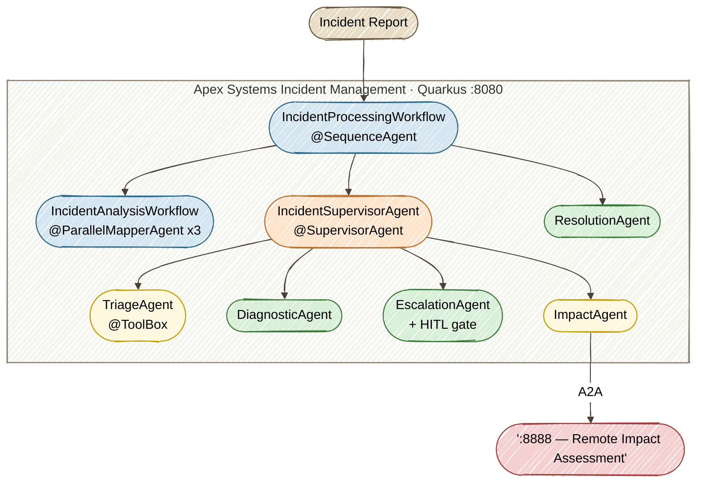

# Lab Overview

---

## The scenario: Apex Systems

**Apex Systems** is a mid-size enterprise IT services company managing infrastructure across data centers and cloud regions. The NOC (Network Operations Center) receives free-text incident reports from monitoring tools, tickets, and on-call engineers — but today those reports live in chat threads, email chains, and tribal knowledge.

Last quarter's post-mortem told the story:

- Two P1 outages (auth failure, API gateway) lasted **4+ hours because manual triage classified them as P3** — $150k combined revenue loss
- A payment-gateway incident was **routed to the networking team instead of payments**, burning 20 engineer-hours before correction
- NOC analysts cannot explain *why* an incident was routed or whether escalation was appropriate — no audit trail exists

Leadership mandate: **automate incident triage and routing with AI agents — without losing enterprise control.**

---

## Why agentic AI (not "just a chatbot")

| Chatbot | Agent |
|---------|-------|
| Answers questions | Takes actions |
| One LLM call | Multi-step reasoning + tool calls |
| No side effects | Mutates state (e.g., `IncidentStatus → TRIAGING`) |
| Stateless | Shares context via `AgenticScope` across workflow |
| Single model | Composed specialists (triage, diagnostic, impact) |

Apex Systems needs systems that **reason** over messy natural-language incident reports, **act** by calling enterprise tools, **collaborate** across specialized roles, **pause** for humans on high-stakes outcomes, and **scale** across teams via open protocols.

---

## What you will build

A production-shaped **agentic incident management platform** on Quarkus — from a single agent to a full supervisor orchestration with human oversight and distributed services.



---

## Your learning path

Each exercise adds a capability that a specific Apex Systems role needs. The persona explains the enterprise problem; in the code-along labs, you implement the Java solution that supports that role.

### Part 1 — Foundations and enterprise control

| Exercise | Persona | Problem | Pattern you learn |
|----------|---------|---------|-------------------|
| [**1 — Agent + tool**](../01-first-agent/START_HERE.md) | **Sam** — NOC analyst | Distinguish actionable reports from false alarms and record triage | `@Agent` + `@ToolBox` |
| [**2 — Policy as prompt**](../02-maintenance-agent/START_HERE.md) | **Chris** — Ops lead | Keep diagnostic guidance consistent as operating policy changes | `@SystemMessage` as policy declaration |
| [**3 — Parallel agents**](../03-parallel-workflow/START_HERE.md) | **Chris** — Ops lead | Gather severity, impact, and resolution analysis without waiting for each in turn | `@ParallelMapperAgent` + `@Output` |
| [**4 — Supervisor orchestration**](../04-supervisor/START_HERE.md) | **Priya** — IT service manager; **Riley** — SRE lead; **Sam** — NOC analyst | Coordinate business priorities, technical response, and incident handoffs | `@SupervisorAgent` within a composed workflow |
| [**5 — AI governance**](../05-ai-governance/START_HERE.md) | **Jordan** — Java platform engineer | Keep AI-assisted contributions grounded in project conventions and source | `AGENTS.md` + OpenCode CLI |
| [**6 — Human gate + tracing**](../06-hitl-observability/START_HERE.md) | **Alex** — Compliance officer | Enforce human approval for sensitive P1/P2 escalations and inspect the decision trace | `@HumanInTheLoop` + OpenTelemetry |
| [**7 — Remote agents (A2A)**](../07-a2a/START_HERE.md) | **Riley** — SRE lead | Share impact assessment through an independently operated service | A2A discovery + `@A2AClientAgent` |
| [**8 — Quality loop (bonus)**](../08-quarkus-flow/START_HERE.md) | **Jordan** — Java platform engineer | Refine post-incident reports against quality criteria within an execution limit | `AgenticServices.loopBuilder()` + Quarkus Flow |

### Part 2 — From Patterns to Production

| Exercise | Persona | Problem | Pattern you learn |
|----------|---------|---------|-------------------|
| [**9 — Plan & Execute**](../09-plan-execute/START_HERE.md) | **Riley** — SRE lead | Plan incident-specific specialist work and re-plan when review identifies gaps | Structured `ExecutionPlan` + Plan → Execute → Review loop |
| [**10 — Memory Tiering**](../10-memory-tiering/START_HERE.md) | **Sam** — NOC analyst | Continue investigations without repeating observations or mixing incident conversations | `@MemoryId` + bounded message window + PostgreSQL `ChatMemoryStore` |
| [**11 — Consensus & Voting**](../11-consensus-voting/START_HERE.md) | **Priya** — IT service manager | Compare reliability, customer-impact, and cost/risk judgments before choosing a response | `@ParallelAgent` + structured ballots + deterministic `@Output` tally |
| [**12 — Event-Driven Agents (capstone)**](../12-event-driven/START_HERE.md) | **Jordan** — Java platform engineer | Accept alerts while agent processing continues and record results asynchronously | Kafka + `@Incoming`/`@Outgoing` + `@Blocking` |

**Exercises 1–4** are hands-on code-along — you type agent code into stub files with hot reload.  
**Exercise 5** uses OpenCode CLI to govern and validate the system you built.  
**Exercise 6** runs and reads the completed HITL solution, tests approval decisions, and inspects OpenTelemetry traces.<br>
**Exercise 7** runs a pre-built A2A solution to explore remote agent patterns.  
**Exercise 8 (bonus)** is a self-paced code-along in a standalone project — builds a programmatic quality loop with Quarkus Flow.<br>
**Exercises 9–12** are advanced code-along labs, each in its own `solutions/<exercise>/lab/` project. Start with the web UI tests; the collapsed Advanced sections offer additional API exploration.

---

## The technology stack

| Layer | Component | Role |
|-------|-----------|------|
| Runtime | Quarkus | Build-time agent validation, fast startup |
| AI extension | Quarkus LangChain4j | Declarative agents, workflows, A2A |
| Dev tooling | OpenCode CLI | SDLC partner: plan → code → test → secure |
| Context efficiency | `AGENTS.md` | Targeted AI assistant context — avoids token-bloat scans |

---

## Learning outcomes

After this lab you will be able to:

- Declare agents with `@Agent`, `@SystemMessage`, `@ToolBox` and explain what Quarkus generates at build time
- Compose multi-agent workflows: sequence, parallel, and supervisor orchestration
- Use `@SupervisorAgent` for adaptive AI routing vs hardcoded conditional logic
- Author an `AGENTS.md` to make OpenCode CLI cost-efficient on agentic projects
- Distribute agents across services with **A2A** (`@A2AClientAgent`)
- Add **human-in-the-loop** gates and read **OpenTelemetry** spans for compliance and FinOps
- Use **programmatic orchestration** (`AgenticServices.loopBuilder()`) to combine agent calls with explicit state, feedback, and bounded iteration
- Build **Plan & Execute** workflows that select specialist steps and re-plan from reviewer feedback
- Give an incident assistant **bounded, database-backed conversation memory** isolated by `@MemoryId`
- Run **parallel voters** and inspect a deterministic tally of their actions, confidence scores, and rationales
- Connect agents to **Kafka events**, distinguishing publication from asynchronous processing and result recording

---

## The seeded incidents

When you start the app in Exercise 1, you'll see 8 incidents in the Incident Dashboard:

| Incident # | System | Service | Priority | Initial Status |
|------------|--------|---------|----------|----------------|
| 1 | payment-gateway | checkout-api | P2 | OPEN |
| 2 | auth-service | user-login | P1 | IN_PROGRESS |
| 3 | inventory-db | stock-sync | P3 | OPEN |
| 4 | cdn-edge | static-assets | P4 | TRIAGING |
| 5 | email-service | notification-api | P2 | OPEN |
| 6 | search-engine | product-search | P3 | OPEN |
| 7 | monitoring | alerting-api | P2 | OPEN |
| 8 | api-gateway | rate-limiter | P1 | IN_PROGRESS |

You'll use these incidents throughout the exercises — processing them with different reports to trigger different agent behaviors.

---

## Patterns cheat sheet

Keep this handy as you work through the exercises:

```
Goal: single specialist agent    → @Agent + @ToolBox               (Ex 1)
Goal: policy as prompt           → @SystemMessage                  (Ex 2)
Goal: step-by-step pipeline      → @SequenceAgent                  (Ex 2–4)
Goal: concurrent work            → @ParallelMapperAgent            (Ex 3)
Goal: data-driven branching      → @ConditionalAgent               (Ex 2)
Goal: adaptive multi-agent       → @SupervisorAgent                (Ex 4)
Goal: AI governance              → AGENTS.md + OpenCode CLI        (Ex 5)
Goal: human approval             → @HumanInTheLoop                 (Ex 6)
Goal: delegate to remote agent   → A2A + @A2AClientAgent           (Ex 7)
Goal: programmatic quality loop  → AgenticServices.loopBuilder()   (Ex 8)
Goal: plan, execute, review      → ExecutionPlan + reviewed loop   (Ex 9)
Goal: incident conversation      → @MemoryId + ChatMemoryStore     (Ex 10)
Goal: compare votes and tally    → @ParallelAgent + @Output        (Ex 11)
Goal: process incident events    → @Incoming/@Outgoing + Kafka     (Ex 12)
```
