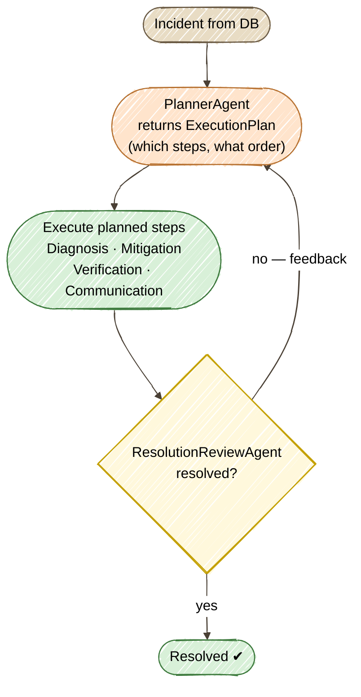

# Exercise 9 — Plan & Execute

<span class="badge badge--code-along">Code-Along</span> <span class="badge" style="background:#1E5AA8;color:white;">Part 2 · Advanced</span>

**Timebox:** 20 minutes  
**Persona:** Jordan — Java platform engineer  
**You work in:** `solutions/09-plan-execute/lab/`  
**Files to edit:**

- `src/.../agentic/agents/PlannerAgent.java`
- `src/.../agentic/workflow/PlanExecuteFlow.java`

!!! tip "Full solution"
    If stuck, the completed files are in [`solutions/09-plan-execute/`](https://github.com/danieloh30/agentic-ai-java-workshop/tree/main/solutions/09-plan-execute){:target="_blank"} — copy them over your TODO files and restart.

---

## Welcome to Part 2 — From Patterns to Production

In Part 1 you built the fundamental patterns: a single agent, policy-as-prompt, parallel agents, a supervisor, governance, a human gate, remote agents, and a quality loop. Part 2 makes those systems **production-grade**: they plan their own work, remember across runs, cross-check each other, and react to events. This is Exercise 1 of the advanced track.

## Why Plan & Execute?

Look at what you built earlier:

- **Exercise 4 (supervisor)** routes between agents, but it decides **one step at a time** as it goes.
- **Exercise 8 (quality loop)** repeats the *same two* agents until a score passes.

Neither one **lays out the whole job up front**. A P4 "slow assets in EU" and a P1 "auth completely down" are not the same amount of work — but a hardcoded pipeline treats them identically.

**Plan & Execute** (Slide pattern #01) fixes this. A **planner** looks at the goal and its available specialists, decides **which to call and in what order** *before* execution, runs them through a shared scope, and **re-plans** if a reviewer says the goal isn't met yet.

### Three moving parts

You'll assemble the pattern from pieces you've already met:

| Part | Who does it | Built with |
|------|-------------|------------|
| **Plan** | `PlannerAgent` — an LLM that returns a structured `ExecutionPlan` (an ordered list of steps) | `@RegisterAiService` with a record return type (structured output, Exercise 8) |
| **Execute** | Four specialist `@Agent`s: Diagnosis, Mitigation, Verification, Communication | plain `@Agent`s (Exercise 4) |
| **Review → re-plan** | `ResolutionReviewAgent` decides *resolved?*; if not, its feedback drives a new plan | an `AgenticServices` loop (Exercise 8) |



!!! note "Why not the `@PlannerAgent` annotation?"
    `quarkus-langchain4j-agentic` *does* ship a `@PlannerAgent` annotation — but unlike `@SupervisorAgent`, it is **not turnkey**. It requires you to supply your own `Planner` implementation through a `@PlannerSupplier` method; there is no built-in LLM DAG planner behind it (the built-in planners are bound to `@SequenceAgent`, `@ParallelAgent`, `@LoopAgent`, and friends). So the clearest way to *learn* Plan & Execute is to build it explicitly on the same `AgenticServices` loop you used in Exercise 8 — and as a bonus, the whole plan is visible from a single `curl`, no Dev UI required.

---

## Step 0 — Start the lab (2 min)

```bash
cd solutions/09-plan-execute/lab
export OPENAI_API_KEY=sk-your-key-here
./mvnw quarkus:dev
```

Wait for PostgreSQL Dev Services to start. Open [http://localhost:8080](http://localhost:8080){:target="_blank"} — the incident dashboard from Part 1, with the same 8 seeded incidents.

!!! warning "Expect a red screen first — that's the point"
    The lab ships with two TODO files. Until `PlannerAgent` has its prompts, Quarkus can't build the AI service and dev mode shows a build error (*"each parameter must be annotated…"*). You'll clear it in Step 1; the app boots green there, and then works end-to-end after Step 2. The four specialists and `ResolutionReviewAgent` are already written — read them as your template.

---

## Step 1 — Give the planner its brain (7 min)

Open `PlannerAgent.java`. It's an ordinary `@RegisterAiService` — the difference from a chatbot is its **return type**: a structured `ExecutionPlan` record, not a `String`. That's how the "Plan" phase hands a machine-readable plan to the executor.

Read the provided models first (`model/ExecutionPlan.java`, `model/ResolutionStep.java`) so you know what the planner must produce:

```java
public enum ResolutionStep { DIAGNOSE, MITIGATE, VERIFY, COMMUNICATE }

public record ExecutionPlan(List<ResolutionStep> steps, String rationale) {}
```

Now replace the `// TODO` on `plan(...)` with the two annotations:

```java
    @SystemMessage("""
            You are the planning agent for an IT incident-management system.
            You do NOT resolve the incident yourself. You decide which specialist steps to
            run, and in what order, then hand that plan off to an executor.

            The available steps are:
              - DIAGNOSE:    investigate and identify the most likely root cause
              - MITIGATE:    take a concrete action to reduce or remove impact (needs a diagnosis first)
              - VERIFY:      confirm whether the incident now appears resolved (needs mitigation first)
              - COMMUNICATE: write a stakeholder status update

            Rules:
              - Order steps so each has what it needs: DIAGNOSE before MITIGATE before VERIFY.
              - Include COMMUNICATE for high-priority incidents (P1/P2); it is optional for low ones.
              - Do not repeat a step that the feedback shows is already done and adequate.
              - If feedback is provided, plan ONLY the additional steps still needed to resolve it.
              - Keep the rationale to a single sentence.
            """)
    @UserMessage("""
            Incident: {system}/{service} (priority {priority}, #{incidentNumber})
            Description: {description}
            Operator report: {report}

            Work done so far / reviewer feedback (empty on the first plan):
            {feedback}
            """)
    ExecutionPlan plan(String system, String service, String priority, String description,
                       Integer incidentNumber, String report, String feedback);
```

Add the imports the annotations need:

```java
import dev.langchain4j.service.SystemMessage;
import dev.langchain4j.service.UserMessage;
```

Save. The build error clears and dev mode boots **green**.

!!! tip "The `{feedback}` placeholder is what makes re-planning possible"
    On the first pass `feedback` is empty and the planner builds a plan from scratch. On a re-plan it carries the reviewer's verdict plus what's been done — so the planner appends only the steps still needed instead of starting over. One prompt, two behaviours.

---

## Step 2 — Wire the Plan → Execute → Review loop (8 min)

Open `PlanExecuteFlow.java`. The six agents are already injected for you; your job is the `resolve(...)` method. It's the **same `AgenticServices.loopBuilder()`** from Exercise 8, but with three actions sharing one `AgenticScope`. Replace the `throw new UnsupportedOperationException(...)` with:

```java
        var planAction = AgenticServices.agentAction(scope -> {
            String feedback = scope.readState("feedback", "");
            int iteration = scope.readState("iteration", 0) + 1;
            scope.writeState("iteration", iteration);

            ExecutionPlan plan = plannerAgent.plan(
                    incident.system, incident.service, incident.priority,
                    incident.description != null ? incident.description : "",
                    incidentNumber, report != null ? report : "", feedback);
            scope.writeState("plan", plan);
            Log.infof("Plan (iteration %d): %s — %s", iteration, plan.steps(), plan.rationale());
        });

        var executeAction = AgenticServices.agentAction(scope -> {
            ExecutionPlan plan = scope.readState("plan", null);
            if (plan == null || plan.steps() == null) {
                return;
            }
            for (ResolutionStep step : new LinkedHashSet<>(plan.steps())) {
                Log.infof("Execute: %s", step);
                switch (step) {
                    case DIAGNOSE -> scope.writeState("diagnosis",
                            diagnosisAgent.diagnose(incident, incidentNumber, report != null ? report : ""));
                    case MITIGATE -> scope.writeState("mitigation",
                            mitigationAgent.mitigate(incident, incidentNumber, scope.readState("diagnosis", "")));
                    case VERIFY -> scope.writeState("verification",
                            verificationAgent.verify(incident, incidentNumber,
                                    scope.readState("diagnosis", ""), scope.readState("mitigation", "")));
                    case COMMUNICATE -> scope.writeState("communication",
                            communicationAgent.communicate(incident, incidentNumber,
                                    scope.readState("diagnosis", ""), scope.readState("mitigation", ""),
                                    scope.readState("verification", "")));
                }
            }
        });

        var reviewAction = AgenticServices.agentAction(scope -> {
            ResolutionReview review = reviewAgent.review(
                    incident.system, incident.service, incident.priority, incidentNumber,
                    scope.readState("diagnosis", ""), scope.readState("mitigation", ""),
                    scope.readState("verification", ""), scope.readState("communication", ""));
            scope.writeState("resolved", review.resolved());
            scope.writeState("feedback", "Reviewer: " + review.feedback());
            Log.infof("Review: resolved=%b — %s", review.resolved(), review.feedback());
        });

        UntypedAgent workflow = AgenticServices.loopBuilder()
                .name("incident-plan-execute-loop")
                .maxIterations(3)
                .exitCondition((scope, iteration) -> scope.readState("resolved", false))
                .subAgents(planAction, executeAction, reviewAction)
                .build();

        return workflow.invokeWithAgenticScope(Map.of()).agenticScope().state();
```

Add the imports:

```java
import java.util.LinkedHashSet;
import dev.langchain4j.agentic.AgenticServices;
import dev.langchain4j.agentic.UntypedAgent;
import com.incidentmanagement.model.ExecutionPlan;
import com.incidentmanagement.model.ResolutionReview;
import com.incidentmanagement.model.ResolutionStep;
import io.quarkus.logging.Log;
```

Save. Dev mode hot-reloads.

!!! note "Execute what the *current* plan says"
    Notice `executeAction` runs whatever is in the latest plan — it doesn't skip a step just because an earlier iteration ran it. That's deliberate: when the reviewer sends VERIFY back for another round, you *want* it to actually run again. Trusting the planner to schedule only what's needed (via the `{feedback}` rule) is what keeps the loop from redoing finished work.

---

## Step 3 — Run it and read the plan (3 min)

Everything is in the response — no Dev UI needed. Start with the P1:

```bash
curl -s -X POST "http://localhost:8080/incident-plan/2" \
  -H "Content-Type: text/plain" \
  --data "Total login failure since 14:00; auth pods OOMKilled" | jq
```

Incident #2 is the P1 `auth-service / user-login` failure. You'll see the planner choose the **full** plan and the loop converge:

```json
{
  "incidentId": 2,
  "plan": ["DIAGNOSE", "MITIGATE", "VERIFY", "COMMUNICATE"],
  "planRationale": "High-priority incident with no prior steps — diagnose, mitigate, verify, and communicate.",
  "iterations": 1,
  "resolved": true,
  "diagnosis": "...", "mitigation": "...", "verification": "RESOLVED ...", "communication": "..."
}
```

Now a low-severity incident:

```bash
curl -s -X POST "http://localhost:8080/incident-plan/4" \
  -H "Content-Type: text/plain" \
  --data "EU users see ~2s asset load; US unaffected" | jq
```

Incident #4 is the P4 `cdn-edge` issue. Watch the **dev-mode log** — this is where re-planning shows itself:

```
Plan (iteration 1): [DIAGNOSE] — P4 incident with no prior steps; start by diagnosing.
Execute: DIAGNOSE
Review: resolved=false — Mitigation and verification steps are needed.
Plan (iteration 2): [MITIGATE, VERIFY] — diagnosis points to network latency; mitigate then verify.
Execute: MITIGATE
Execute: VERIFY
Review: resolved=true — diagnosis, mitigation, and a RESOLVED verification are all present.
```

Same code, **a different plan per incident** — and when the first round falls short, the reviewer's feedback drives a **second plan** that finishes the job. That is Plan & Execute.

The **dashboard** works too: open an incident and click **Process Incident** — it runs the same flow and flips the incident to RESOLVED.

---

## What you learned

- **Plan & Execute** separates *deciding the work* (`PlannerAgent` → `ExecutionPlan`) from *doing the work* (the specialist `@Agent`s) — so the plan adapts per incident instead of running a fixed shape.
- **Structured output** (a record return type) turns an LLM into a planner your code can act on programmatically.
- **Dynamic re-planning** falls out of a loop: a reviewer writes `feedback`, the planner reads it and schedules only what's still needed, and an `exitCondition` ends the loop as soon as the incident is resolved.
- Specialists share data through `AgenticScope` (`outputKey` → `{placeholder}`), exactly as in Exercise 4 — and the same `loopBuilder` from Exercise 8 drives the whole thing.

??? tip "Stretch goals"
    - Raise `maxIterations` and feed a vague report — how many rounds until the reviewer is satisfied, or does it give up?
    - Add a fifth `ResolutionStep` (e.g. `POSTMORTEM`) plus a specialist, and mention it in the planner's system prompt — watch it fold into plans with no loop change.
    - Tighten the planner's rules so a P4 never runs COMMUNICATE, and confirm it in the log.

Next: **Exercise 10 — Memory Tiering**, where agents stop being amnesiac. *(coming next in Part 2)*
