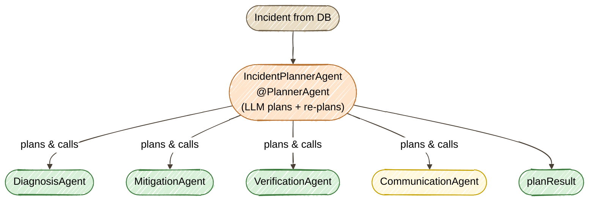

# Exercise 9 — Plan & Execute (`@PlannerAgent`)

<span class="badge badge--code-along">Code-Along</span> <span class="badge" style="background:#1E5AA8;color:white;">Part 2 · Advanced</span>

**Timebox:** 20 minutes  
**Persona:** Jordan — Java platform engineer  
**You work in:** `solutions/09-plan-execute/lab/`  
**Files to edit:**

- `src/.../agentic/agents/DiagnosisAgent.java`
- `src/.../agentic/agents/MitigationAgent.java`
- `src/.../agentic/agents/IncidentPlannerAgent.java`

!!! tip "Full solution"
    If stuck, the completed files are in [`solutions/09-plan-execute/`](https://github.com/danieloh30/agentic-ai-java-workshop/tree/main/solutions/09-plan-execute){:target="_blank"} — copy them over your TODO files and restart.

---

## Welcome to Part 2 — From Patterns to Production

In Part 1 you built the fundamental patterns: a single agent, policy-as-prompt, parallel agents, a supervisor, governance, a human gate, remote agents, and a quality loop. Part 2 makes those systems **production-grade**: they plan their own work, remember across runs, cross-check each other, and react to events. This is Exercise 1 of the advanced track.

## Why Plan & Execute?

Look at what you built earlier:

- **Exercise 4 (supervisor)** routes between agents, but it decides **one step at a time** as it goes.
- **Exercise 8 (quality loop)** repeats the *same two* agents until a score passes.

Neither one **lays out the whole job up front**. A P4 "slow assets in EU" and a P1 "auth completely down" are not the same amount of work — but a hardcoded pipeline treats them identically.

**Plan & Execute** (Slide pattern #01) fixes this. A **planner** looks at the goal and its available specialists, decides **which to call and in what order** *before* execution, runs them through a shared scope, and **re-plans** if the goal isn't met yet.

### You've already met its sibling

In Exercise 4 you wrote `@SupervisorAgent`. Plan & Execute has a declarative twin: **`@PlannerAgent`**. You hand it a set of sub-agents; a built-in LLM planner does the DAG decomposition and dynamic re-planning for you. No hand-written loop, no JSON plan record to parse — the same "reasoning units are `@Agent`, orchestration is an annotation" style you've used all workshop.



!!! note "The plan is not something you write"
    With `@SupervisorAgent` and `@PlannerAgent`, the DAG lives **inside the framework**. Your job is to give the planner (a) capable specialists and (b) **descriptions good enough for it to plan over**. The `description` on each `@Agent` is the planner's menu — it's how the planner decides *whether* and *when* to call each one.

---

## Step 0 — Start the lab (2 min)

```bash
cd solutions/09-plan-execute/lab
export OPENAI_API_KEY=sk-your-key-here
./mvnw quarkus:dev
```

Wait for PostgreSQL Dev Services to start. Open [http://localhost:8080](http://localhost:8080){:target="_blank"} — the incident dashboard from Part 1, with the same 8 seeded incidents.

!!! warning "Expect a red screen first — that's the point"
    A declarative planner must be **fully wired** to boot: until `IncidentPlannerAgent` carries `@PlannerAgent`, Quarkus can't produce the bean and dev mode shows an *unsatisfied dependency* error. You'll clear it by completing the three files below; each save hot-reloads. (`VerificationAgent` and `CommunicationAgent` are already written — read them as your template.)

---

## Step 1 — Write the `DiagnosisAgent` specialist (5 min)

Open `DiagnosisAgent.java`. It's a plain `@Agent` — exactly like the specialists you wrote in Exercise 4. Replace the `// TODO` with the real annotations:

```java
    @SystemMessage("""
            You are a diagnosis specialist for an IT incident-management system.
            Identify the single most likely root cause of the incident and the evidence
            for it. Use only the incident facts provided; do not invent metrics or logs.
            Keep it to 2–4 sentences.
            """)
    @UserMessage("""
            Incident: {incidentInfo.system}/{incidentInfo.service} (P{incidentInfo.priority}, #{incidentNumber})
            Description: {incidentInfo.description}
            Operator report: {report}
            """)
    @Agent(description = "Investigates the incident and identifies the most likely root cause.",
           outputKey = "diagnosis")
    String diagnose(IncidentInfo incidentInfo, Integer incidentNumber, String report);
```

Add the imports the annotations need:

```java
import dev.langchain4j.agentic.Agent;
import dev.langchain4j.service.SystemMessage;
import dev.langchain4j.service.UserMessage;
```

!!! tip "The `description` is planner-facing copy"
    "Investigates the incident and identifies the most likely root cause." isn't a comment — it's the text the planner reads to decide this step belongs early. Write descriptions for the planner, not for humans.

---

## Step 2 — Write the `MitigationAgent` specialist (4 min)

Open `MitigationAgent.java`. Same shape, but notice how the `description` **hints ordering** — that's how the planner learns to run mitigation *after* diagnosis without you wiring an edge:

```java
    @SystemMessage("""
            You are a mitigation specialist for an IT incident-management system.
            Given the incident and its diagnosis, state the single concrete mitigating
            action to take and its expected effect. Do not claim work is already done that
            you were not asked to do. Keep it to 2–4 sentences.
            """)
    @UserMessage("""
            Incident: {incidentInfo.system}/{incidentInfo.service} (P{incidentInfo.priority}, #{incidentNumber})
            Description: {incidentInfo.description}

            Diagnosis (if available): {diagnosis}
            """)
    @Agent(description = "Takes a concrete action to reduce or remove the incident's impact. Best run after a diagnosis exists.",
           outputKey = "mitigation")
    String mitigate(IncidentInfo incidentInfo, Integer incidentNumber, String diagnosis);
```

Add the same three imports.

!!! note "How does `{diagnosis}` get filled?"
    `DiagnosisAgent` writes `outputKey = "diagnosis"` into the shared `AgenticScope`; `MitigationAgent`'s `@UserMessage` reads `{diagnosis}` back out. Same scope-threading you saw with the supervisor in Exercise 4 — no Java glue passing values between agents.

`VerificationAgent` and `CommunicationAgent` are already written for you the same way (verify-last, communicate-for-high-priority). Skim them so you know what's on the planner's menu.

---

## Step 3 — Declare the `@PlannerAgent` (6 min)

Open `IncidentPlannerAgent.java` — the star of the exercise. Replace the `// TODO` by annotating the method. You're not writing planning logic; you're **naming the specialists** and letting the framework's planner reason over them:

```java
    @PlannerAgent(
            outputKey = "planResult",
            subAgents = {
                    DiagnosisAgent.class,
                    MitigationAgent.class,
                    VerificationAgent.class,
                    CommunicationAgent.class
            })
    String resolveIncident(IncidentInfo incidentInfo, Integer incidentNumber, String report);
```

The import is already present. Save — the red screen clears and Quarkus boots green.

!!! info "`@PlannerAgent` vs `@SupervisorAgent`"
    Both take `subAgents` and let an LLM choose what to call. The difference is *when* the decision is made: a supervisor decides the **next** step reactively each turn; a planner decides the **whole plan** up front, then executes and re-plans if needed. For incident resolution — where the shape of the work varies per incident but the specialists are fixed — the planner is the cleaner fit.

!!! tip "Agentic Dev UI"
    Open the [topology view](http://localhost:8080/q/dev-ui/quarkus-langchain4j-agentic/topology){:target="_blank"}: `IncidentPlannerAgent` sits at the root with all four specialists beneath it. The [Agents tab](http://localhost:8080/q/dev-ui/quarkus-langchain4j-agentic/agents){:target="_blank"} shows each agent's `outputKey` and description — a quick check that your descriptions read the way the planner will see them.

---

## Step 4 — Run it and read the executed plan (3 min)

The plan is now framework-internal, so you observe it through the **executed calls**, not a JSON DAG. Kick it off:

```bash
curl -s -X POST "http://localhost:8080/incident-plan/2" | jq
```

Incident #2 is the P1 `auth-service / user-login` "Complete authentication failure". You get back the consolidated `planResult`. The dev-mode log shows the run starting:

```
Starting Plan & Execute for incident #2 (auth-service/user-login P1)
```

To see **which specialists ran, in what order** — the executed plan — open the [Agentic Dev UI traces](http://localhost:8080/q/dev-ui/quarkus-langchain4j-agentic/topology){:target="_blank"}. Each specialist that the planner invoked lights up under `IncidentPlannerAgent`, in the order it decided. That sequence *is* the plan — chosen from your descriptions, not hardcoded.

Now contrast with a low-severity incident:

```bash
curl -s -X POST "http://localhost:8080/incident-plan/4" | jq
```

Incident #4 is the P4 `cdn-edge` issue. Watch the traces: the planner typically runs **fewer** specialists (it may skip `CommunicationAgent` for a P4). Same code, **different plan per incident** — that's the whole point.

The **dashboard** works too: open an incident and click **Process Incident** — it runs the same planner and flips the incident to RESOLVED.

---

## What you learned

- **Plan & Execute** separates *deciding the work* from *doing the work* — so the plan adapts per incident instead of running a fixed shape.
- **`@PlannerAgent`** is the declarative twin of `@SupervisorAgent`: you supply specialists, the framework plans, executes, and re-plans.
- The **`description` on each `@Agent`** is the planner's menu — good descriptions (including ordering hints) are how you steer the plan without writing a loop.
- Specialists share data through `AgenticScope` (`outputKey` → `{placeholder}`), exactly as in Exercise 4.

??? tip "Stretch goals"
    - Tighten `MitigationAgent`'s description to remove the ordering hint — does the planner still run diagnosis first?
    - Add a fifth specialist (e.g. a `RootCauseDocAgent`) and watch the planner fold it in with no other code change.
    - Compare the log for a P1 vs a P4 and note how many specialists each plan uses.

Next: **Exercise 10 — Memory Tiering**, where agents stop being amnesiac. *(coming next in Part 2)*
