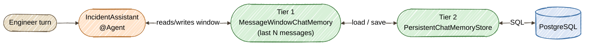

# Exercise 10 — Memory Tiering

<span class="badge badge--code-along">Code-Along</span> <span class="badge" style="background:#1E5AA8;color:white;">Part 2 · Advanced</span>

**Timebox:** 20 minutes  
**Persona:** Jordan — Java platform engineer  
**You work in:** `solutions/10-memory-tiering/lab/`  
**Files to edit:**

- `src/.../memory/PersistentChatMemoryStore.java`
- `src/.../agentic/agents/IncidentAssistant.java`

!!! tip "Full solution"
    If stuck, the completed files are in [`solutions/10-memory-tiering/`](https://github.com/danieloh30/agentic-ai-java-workshop/tree/main/solutions/10-memory-tiering){:target="_blank"} — copy them over your TODO files and restart.

---

## Why memory tiering?

Every agent you've built so far is **amnesiac**. Each call starts from nothing; the only "memory" is whatever you stuff into the prompt that turn. That's fine for a one-shot draft or a plan — but an on-call engineer working an incident has a *conversation*: "the pods are OOMKilled" … "what did I just tell you?" … "given that, what next?". The agent has to remember.

Two forces pull in opposite directions:

- **The model only sees its context window.** You can't send an unbounded transcript every turn — it's slow, expensive, and eventually overflows. So working memory must be **bounded**.
- **But the conversation must outlive a single request** — and ideally a single process. Memory you keep only in a `HashMap` on the heap vanishes on restart and can't be shared across replicas.

**Memory tiering** resolves this with two layers:

| Tier | What it is | Built with |
|------|-----------|-----------|
| **Tier 1 — working memory** | The last *N* messages, the slice actually sent to the model each turn | `MessageWindowChatMemory` |
| **Tier 2 — durable store** | Where those messages are read from and written to — a real database | a custom `ChatMemoryStore` over PostgreSQL |



!!! note "The agentic-native wiring: `@ChatMemoryProviderSupplier`"
    You met declarative `@Agent`s in Exercises 4 and 9. `quarkus-langchain4j-agentic` lets an `@Agent` bring its **own** memory through a `@ChatMemoryProviderSupplier` — a static method that hands the agent a `ChatMemory`. That one method is where the two tiers meet: it builds the Tier 1 window *over* the Tier 2 store.

---

## Step 0 — Start the lab (2 min)

```bash
cd solutions/10-memory-tiering/lab
export OPENAI_API_KEY=sk-your-key-here
./mvnw quarkus:dev
```

Wait for PostgreSQL Dev Services to start. Open [http://localhost:8080](http://localhost:8080){:target="_blank"} — the same incident dashboard, same 8 seeded incidents.

!!! warning "Expect a red screen first — that's the point"
    The lab ships with two TODO files. Until `IncidentAssistant` is a wired `@Agent`, Quarkus can't produce the bean and dev mode shows an *unsatisfied dependency*. You'll clear it across the two steps below; each save hot-reloads.

---

## Step 1 — Build Tier 2: the durable store (7 min)

Open `PersistentChatMemoryStore.java`. It implements LangChain4j's `ChatMemoryStore` — three methods that move a list of `ChatMessage` in and out of a database row. The entity is already written for you (`memory/ChatMemoryEntity.java`): one row per conversation, keyed by `memoryId`, transcript held as JSON in a `text` column.

Replace the three `throw`s:

```java
    @Override
    @Transactional
    public List<ChatMessage> getMessages(Object memoryId) {
        ChatMemoryEntity entity = ChatMemoryEntity.findById(key(memoryId));
        if (entity == null || entity.messagesJson == null) {
            return List.of();
        }
        return ChatMessageDeserializer.messagesFromJson(entity.messagesJson);
    }

    @Override
    @Transactional
    public void updateMessages(Object memoryId, List<ChatMessage> messages) {
        String id = key(memoryId);
        ChatMemoryEntity entity = ChatMemoryEntity.findById(id);
        if (entity == null) {
            entity = new ChatMemoryEntity();
            entity.id = id;
        }
        entity.messagesJson = ChatMessageSerializer.messagesToJson(messages);
        entity.persist();
    }

    @Override
    @Transactional
    public void deleteMessages(Object memoryId) {
        ChatMemoryEntity.deleteById(key(memoryId));
    }

    private static String key(Object memoryId) {
        return String.valueOf(memoryId);
    }
```

Add the imports:

```java
import jakarta.transaction.Transactional;
import dev.langchain4j.data.message.ChatMessageDeserializer;
import dev.langchain4j.data.message.ChatMessageSerializer;
```

!!! tip "That's the whole integration"
    You didn't register this store anywhere. Because it's an `@ApplicationScoped` bean implementing `ChatMemoryStore`, quarkus-langchain4j picks it up and uses it in place of its default in-memory store. Serialization is LangChain4j's job (`ChatMessageSerializer`/`Deserializer`) — you only shuttle JSON to and from a row.

---

## Step 2 — Build Tier 1 over Tier 2 (8 min)

Open `IncidentAssistant.java`. First, annotate the `chat` method to make it a real conversational agent:

```java
    @SystemMessage("""
            You are an on-call incident assistant for an IT incident-management system.
            You help an engineer reason about ONE incident across a back-and-forth
            conversation. Remember what the engineer has already told you in this
            conversation and build on it — do not ask again for facts you were given.
            Be concise and concrete. Never invent metrics, logs, or actions that were not
            stated. If you don't have enough information, say what you'd need.
            """)
    @Agent(description = "Conversational assistant that reasons about a single incident with memory of the conversation so far.",
           outputKey = "assistantReply")
    String chat(@MemoryId Integer incidentId, @UserMessage String message);
```

Then add the supplier that wires the two tiers together:

```java
    @ChatMemoryProviderSupplier
    static ChatMemory chatMemory(Object memoryId) {
        PersistentChatMemoryStore store = Arc.container().instance(PersistentChatMemoryStore.class).get();
        return MessageWindowChatMemory.builder()
                .id(memoryId)
                .maxMessages(20)      // Tier 1: only the last 20 messages go to the model
                .chatMemoryStore(store) // Tier 2: read/write those through PostgreSQL
                .build();
    }
```

Add the imports:

```java
import com.incidentmanagement.memory.PersistentChatMemoryStore;
import dev.langchain4j.agentic.Agent;
import dev.langchain4j.agentic.declarative.ChatMemoryProviderSupplier;
import dev.langchain4j.memory.ChatMemory;
import dev.langchain4j.memory.chat.MessageWindowChatMemory;
import dev.langchain4j.service.SystemMessage;
import io.quarkus.arc.Arc;
```

Save. The red screen clears and Quarkus boots green.

!!! note "Two knobs, two tiers"
    `maxMessages(20)` is Tier 1 — the cap on what the model sees per turn. `chatMemoryStore(store)` is Tier 2 — where that window lives between turns. Raise the cap and the model remembers more per turn but each call costs more; keep it low and rely on the store to hold what matters. Tuning that trade-off *is* memory tiering.

!!! tip "Why resolve the store through `Arc`?"
    The supplier is a `static` method, so it can't `@Inject`. `Arc.container().instance(...).get()` fetches the CDI bean at call time — which keeps the `@Transactional` interceptors on the store's methods working.

---

## Step 3 — Prove it remembers (3 min)

Turn 1 — tell the assistant a symptom (the message is the request body):

```bash
curl -s -X POST "http://localhost:8080/incident-assistant/2" \
  -H "Content-Type: text/plain" \
  --data "The auth-service pods are OOMKilled every ~5 minutes. Where do I start?" | jq
```

Turn 2 — same incident id (`2` = same `@MemoryId` = same conversation) — ask it to recall:

```bash
curl -s -X POST "http://localhost:8080/incident-assistant/2" \
  -H "Content-Type: text/plain" \
  --data "Remind me: what symptom did I report a moment ago?" | jq
```

The reply names the **OOMKilled pods** — it never appeared in turn 2's message. That's Tier 1 doing its job: the window replayed turn 1 into the model's context.

Now peek at **Tier 2** directly:

```bash
curl -s "http://localhost:8080/incident-assistant/2/history" | jq
```

```json
{ "incidentId": 2, "messageCount": 5, "messages": ["SYSTEM", "USER", "AI", "USER", "AI"] }
```

Those messages are rows in PostgreSQL, serialized by your store — not heap state. Open the [Dev UI database view](http://localhost:8080/q/dev-ui/io.quarkus.quarkus-agroal/datasources){:target="_blank"} and query `chatmemoryentity` to see the JSON transcript itself.

Finally, confirm conversations are **isolated** by `@MemoryId` — a different incident is a different memory:

```bash
curl -s "http://localhost:8080/incident-assistant/4/history" | jq  # messageCount: 0
```

The **dashboard** ties it together: click **Process Incident** on an incident to open the conversation (turn 1 seeds the memory with the incident facts), then keep chatting via the endpoint above.

!!! info "Durability, honestly"
    Because memory lives in PostgreSQL, it's **externalized** — survives across requests, shareable across replicas, and it outlives restarts *when pointed at a persistent database*. In this lab, Dev Services hands you a fresh throwaway Postgres each launch, so a dev-mode restart starts clean. Point `quarkus.datasource.*` at a managed Postgres and the same code keeps the transcript across restarts — no code change, that's the payoff of putting Tier 2 in a real store.

---

## What you learned

- **Agents are amnesiac by default** — memory is an explicit component you attach, not a freebie.
- **Two tiers** solve the tension between a bounded context window and a conversation that must persist: `MessageWindowChatMemory` (Tier 1) caps what the model sees; a `ChatMemoryStore` (Tier 2) is where it lives.
- A custom `ChatMemoryStore` bean is the entire persistence integration — quarkus-langchain4j discovers it and routes memory through your database.
- `@ChatMemoryProviderSupplier` is the agentic-native way to give an `@Agent` its own memory, and `@MemoryId` scopes a conversation (here, one per incident).

??? tip "Stretch goals"
    - Drop `maxMessages` to `2` and rerun the two turns — does recall break? Watch how Tier 1 size changes what the model can "see" even though Tier 2 still has everything.
    - Add a `DELETE /incident-assistant/{id}` endpoint that calls `deleteMessages` — a "forget this conversation" button.
    - Give a *second* agent the same `@MemoryId` and store, and watch two agents share one conversation's memory.

Next: **Exercise 11 — Consensus & Voting**, where multiple agents cross-check each other. *(coming next in Part 2)*
