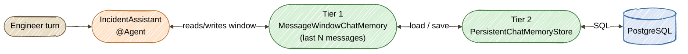

# Exercise 10 — Memory Tiering

<span class="badge badge--code-along">Code-Along</span> <span class="badge" style="background:#1E5AA8;color:white;">Part 2 · Advanced</span>

**Timebox:** 20 minutes  
**Persona:** Sam — NOC analyst<br>
**You work in:** `solutions/10-memory-tiering/lab/`  
**Files to edit:**

- `src/.../memory/PersistentChatMemoryStore.java`
- `src/.../agentic/agents/IncidentAssistant.java`

!!! tip "Full solution"
    If stuck, the completed files are in [`solutions/10-memory-tiering/`](https://github.com/danieloh30/agentic-ai-java-workshop/tree/main/solutions/10-memory-tiering){:target="_blank"} — copy them over your TODO files and restart.

---

## Enterprise context

**Sam, Apex Systems' NOC analyst, investigates several incidents during a shift and needs an assistant that can follow each conversation.** Sam might first report OOMKilled pods, then ask for the next diagnostic step or a reminder of the symptom. Repeating the same observations on every turn interrupts the investigation and makes it easier to omit a detail. Switching from an authentication outage to a CDN incident introduces another requirement: the assistant must keep those conversations separate rather than reuse the wrong incident's symptoms.

Sam needs the engineering team to provide conversation continuity while controlling how much history the model receives. This lab combines a bounded message window with PostgreSQL storage and uses the incident ID to select the conversation. Follow-up questions let Sam test recall; switching incidents tests isolation, and the history endpoint shows which messages were stored. The store holds the configured window rather than an unlimited archive, and keeping it across application restarts requires a persistent database instead of the lab's throwaway Dev Services database.

## The goal

Implement the PostgreSQL chat-memory store and attach a bounded message window to the incident assistant. Use the web UI to verify follow-up recall and conversation isolation, then inspect the stored history to connect the model's working memory to the database.

## Why memory tiering?

Every agent you've built so far is **amnesiac**. Each call starts from nothing; the only "memory" is whatever you stuff into the prompt that turn. That's fine for a one-shot draft or a plan — but an on-call engineer working an incident has a *conversation*: "the pods are OOMKilled" … "what did I just tell you?" … "given that, what next?". The agent has to remember.

Two forces pull in opposite directions:

- **The model only sees its context window.** You can't send an unbounded transcript every turn — it's slow, expensive, and eventually overflows. So working memory must be **bounded**.
- **But the conversation must outlive a single request** — and ideally a single process. Memory you keep only in a `HashMap` on the heap vanishes on restart and can't be shared across replicas.

**Memory tiering** resolves this with two layers:

| Tier | What it is | Built with |
|------|-----------|-----------|
| **Tier 1 — working memory** | The last *N* messages, the slice actually sent to the model each turn | `MessageWindowChatMemory` |
| **Tier 2 — durable store** | Where those messages are read from and written to — a real database | a custom `ChatMemoryStore` over PostgreSQL |


```mermaid
%%{init: {'look':'handDrawn','theme':'neutral','themeVariables': {'lineColor':'#4A4035'}}}%%
flowchart LR
    USER(["Engineer turn"])
    AGENT(["IncidentAssistant<br/>@Agent"])
    WIN(["Tier 1<br/>MessageWindowChatMemory<br/>(last N messages)"])
    STORE(["Tier 2<br/>PersistentChatMemoryStore"])
    DB[("PostgreSQL")]

    USER --> AGENT
    AGENT <-->|reads/writes window| WIN
    WIN <-->|load / save| STORE
    STORE <-->|SQL| DB

    style USER fill:#E8DCC4,stroke:#6B5B45
    style AGENT fill:#FFE4CC,stroke:#B87333
    style WIN fill:#D8F0D8,stroke:#3D7A3D
    style STORE fill:#D8F0D8,stroke:#3D7A3D
    style DB fill:#DCE6F5,stroke:#3A6EA5
```

!!! note "The agentic-native wiring: `@ChatMemoryProviderSupplier`"
    You met declarative `@Agent`s in Exercises 4 and 9. `quarkus-langchain4j-agentic` lets an `@Agent` bring its **own** memory through a `@ChatMemoryProviderSupplier` — a static method that hands the agent a `ChatMemory`. That one method is where the two tiers meet: it builds the Tier 1 window *over* the Tier 2 store.

---

## Step 0 — Start the lab (2 min)

```bash
cd solutions/10-memory-tiering/lab
export OPENAI_API_KEY=sk-your-key-here
./mvnw quarkus:dev
```

Wait for PostgreSQL Dev Services to start. Open [http://localhost:8080](http://localhost:8080){:target="_blank"} — the same incident dashboard, same 8 seeded incidents.

!!! warning "Expect a red screen first — that's the point"
    The lab ships with two TODO files. Until `IncidentAssistant` is a wired `@Agent`, Quarkus can't produce the bean and dev mode shows an *unsatisfied dependency*. You'll clear it across the two steps below; each save hot-reloads.

---

## Step 1 — Build Tier 2: the durable store (7 min)

Open `PersistentChatMemoryStore.java`. It implements LangChain4j's `ChatMemoryStore` — three methods that move a list of `ChatMessage` in and out of a database row. The entity is already written for you (`memory/ChatMemoryEntity.java`): one row per conversation, keyed by `memoryId`, transcript held as JSON in a `text` column.

Replace the three `throw`s:

```java
    @Override
    @Transactional
    public List<ChatMessage> getMessages(Object memoryId) {
        ChatMemoryEntity entity = ChatMemoryEntity.findById(key(memoryId));
        if (entity == null || entity.messagesJson == null) {
            return List.of();
        }
        return ChatMessageDeserializer.messagesFromJson(entity.messagesJson);
    }

    @Override
    @Transactional
    public void updateMessages(Object memoryId, List<ChatMessage> messages) {
        String id = key(memoryId);
        ChatMemoryEntity entity = ChatMemoryEntity.findById(id);
        if (entity == null) {
            entity = new ChatMemoryEntity();
            entity.id = id;
        }
        entity.messagesJson = ChatMessageSerializer.messagesToJson(messages);
        entity.persist();
    }

    @Override
    @Transactional
    public void deleteMessages(Object memoryId) {
        ChatMemoryEntity.deleteById(key(memoryId));
    }

    private static String key(Object memoryId) {
        return String.valueOf(memoryId);
    }
```

Add the imports:

```java
import jakarta.transaction.Transactional;
import dev.langchain4j.data.message.ChatMessageDeserializer;
import dev.langchain4j.data.message.ChatMessageSerializer;
```

!!! tip "That's the whole integration"
    You didn't register this store anywhere. Because it's an `@ApplicationScoped` bean implementing `ChatMemoryStore`, quarkus-langchain4j picks it up and uses it in place of its default in-memory store. Serialization is LangChain4j's job (`ChatMessageSerializer`/`Deserializer`) — you only shuttle JSON to and from a row.

---

## Step 2 — Build Tier 1 over Tier 2 (8 min)

Open `IncidentAssistant.java`. First, annotate the `chat` method to make it a real conversational agent:

```java
    @SystemMessage("""
            You are an on-call incident assistant for an IT incident-management system.
            You help an engineer reason about ONE incident across a back-and-forth
            conversation. Remember what the engineer has already told you in this
            conversation and build on it — do not ask again for facts you were given.
            Be concise and concrete. Never invent metrics, logs, or actions that were not
            stated. If you don't have enough information, say what you'd need.
            """)
    @Agent(description = "Conversational assistant that reasons about a single incident with memory of the conversation so far.",
           outputKey = "assistantReply")
    String chat(@MemoryId Integer incidentId, @UserMessage String message);
```

Then add the supplier that wires the two tiers together:

```java
    @ChatMemoryProviderSupplier
    static ChatMemory chatMemory(Object memoryId) {
        PersistentChatMemoryStore store = Arc.container().instance(PersistentChatMemoryStore.class).get();
        return MessageWindowChatMemory.builder()
                .id(memoryId)
                .maxMessages(20)      // Tier 1: only the last 20 messages go to the model
                .chatMemoryStore(store) // Tier 2: read/write those through PostgreSQL
                .build();
    }
```

Add the imports:

```java
import com.incidentmanagement.memory.PersistentChatMemoryStore;
import dev.langchain4j.agentic.Agent;
import dev.langchain4j.agentic.declarative.ChatMemoryProviderSupplier;
import dev.langchain4j.memory.ChatMemory;
import dev.langchain4j.memory.chat.MessageWindowChatMemory;
import dev.langchain4j.service.SystemMessage;
import io.quarkus.arc.Arc;
```

Save. The red screen clears and Quarkus boots green.

!!! note "Two knobs, two tiers"
    `maxMessages(20)` is Tier 1 — the cap on what the model sees per turn. `chatMemoryStore(store)` is Tier 2 — where that window lives between turns. Raise the cap and the model remembers more per turn but each call costs more; keep it low and rely on the store to hold what matters. Tuning that trade-off *is* memory tiering.

!!! tip "Why resolve the store through `Arc`?"
    The supplier is a `static` method, so it can't `@Inject`. `Arc.container().instance(...).get()` fetches the CDI bean at call time — which keeps the `@Transactional` interceptors on the store's methods working.

---

## Step 3 — Test memory in the web UI (3 min)

Open [http://localhost:8080](http://localhost:8080){:target="_blank"} and start a conversation:

1. Click **incident #2** — the `auth-service / user-login` failure.
2. Enter this report:

    ```text
    The auth-service pods are OOMKilled every ~5 minutes. Where do I start?
    ```

3. Click **Process Incident**. The panel stays open and shows the **Assistant Reply**. The incident remains **In Progress** — this exercise provides advice rather than resolving it.

<figure class="memory-screenshot">
  <a href="../../images/test-momory-1.png" target="_blank" rel="noopener" title="Open the initial assessment screenshot at full size">
    
  </a>
  <figcaption>Initial assessment · Click to enlarge</figcaption>
</figure>

Now test recall in the same panel:

1. In **Continue Conversation**, enter:

    ```text
    Remind me: what symptom did I report a moment ago?
    ```

2. Click **Send Message**. The reply should mention the **OOMKilled pods** or their five-minute restart pattern, even though you did not repeat that symptom in the follow-up.

<figure class="memory-screenshot">
  <a href="../../images/test-momory-2.png" target="_blank" rel="noopener" title="Open the memory recall screenshot at full size">
    
  </a>
  <figcaption>Memory recall · Click to enlarge</figcaption>
</figure>

That is Tier 1 doing its job: the window replayed the earlier turn into the model's context. Closing and reopening incident #2 keeps its latest reply visible while the page is open. The dashboard holds that displayed reply in a JavaScript map. Refreshing clears the map, and reopening #2 shows **Process Incident** with no previous reply because the dashboard does not reload stored messages.

Verify that **Tier 2** still holds the conversation:

1. Open [incident #2's history](http://localhost:8080/incident-assistant/2/history){:target="_blank"} in another browser tab. After these two turns, a fresh conversation typically contains five messages:

    ```json
    { "incidentId": 2, "messageCount": 5, "messages": ["SYSTEM", "USER", "AI", "USER", "AI"] }
    ```

2. Refresh the dashboard and reopen **incident #2**. The previous reply is no longer displayed.
3. Reload the **history tab**. The message count and types should remain the same while Quarkus keeps running. This endpoint reads `PersistentChatMemoryStore`, which loads the messages from PostgreSQL. It returns message types only; it does not display the conversation text.
4. Open the [Dev UI database view](http://localhost:8080/q/dev-ui/quarkus-agroal/database-view){:target="_blank"}, select `chatmemoryentity`, and find the row with `id` = `2`. Inspect `messagesJson` to see the saved operator messages and assistant replies, including the OOMKilled symptom. You can also reach this view from [Dev UI](http://localhost:8080/q/dev-ui/){:target="_blank"} by clicking **Database view** in the **Agroal - DB connection pool** card.

The empty dashboard panel after a refresh reflects the display behavior; the history endpoint and database row let you verify the server's stored conversation.

Finally, confirm memory isolation:

1. Open [incident #4's history](http://localhost:8080/incident-assistant/4/history){:target="_blank"} before chatting with it. On a fresh lab, `messageCount` is `0`.
2. Return to the dashboard, open **incident #4**, and submit:

    ```text
    What symptom did I report earlier in this conversation?
    ```

3. The assistant should have no earlier operator symptom to recall for #4. It can refer to #4's seeded CDN description, but should not recall #2's OOMKilled pods. Each incident ID has its own `@MemoryId`.

!!! info "Durability, honestly"
    Because memory lives in PostgreSQL, it's **externalized** — survives across requests, shareable across replicas, and it outlives restarts *when pointed at a persistent database*. In this lab, Dev Services hands you a fresh throwaway Postgres each launch, so a dev-mode restart starts clean. Point `quarkus.datasource.*` at a managed Postgres and the same code keeps the transcript across restarts — no code change, that's the payoff of putting Tier 2 in a real store.

??? info "Advanced — Run again and inspect JSON"

    The web UI tests above are sufficient to complete this exercise. **Keep Quarkus running; no restart is required.** The POST requests below add turns to the existing incident conversation, including any turns from the UI tests. The history GET requests only read the stored messages; use them on their own if you just want to inspect the current conversation.

    The chat endpoint accepts the message as a `text/plain` request body. These requests add turns to the same conversation used by the dashboard:

    ```bash
    curl -s -X POST "http://localhost:8080/incident-assistant/2" \
      -H "Content-Type: text/plain" \
      --data "The auth-service pods are OOMKilled every ~5 minutes. Where do I start?" | jq
    ```

    Turn 2 — same incident id (`2` = same `@MemoryId` = same conversation) — ask it to recall:

    ```bash
    curl -s -X POST "http://localhost:8080/incident-assistant/2" \
      -H "Content-Type: text/plain" \
      --data "Remind me: what symptom did I report a moment ago?" | jq
    ```

    The second reply should recall the symptom from the first message.

    Now peek at **Tier 2** directly:

    ```bash
    curl -s "http://localhost:8080/incident-assistant/2/history" | jq
    ```

    ```json
    { "incidentId": 2, "messageCount": 5, "messages": ["SYSTEM", "USER", "AI", "USER", "AI"] }
    ```

    This example is for a fresh two-turn conversation; the count is higher if you already completed the UI steps, up to the configured message-window limit.

    Finally, confirm conversations are **isolated** by `@MemoryId` — a different incident is a different memory:

    ```bash
    curl -s "http://localhost:8080/incident-assistant/4/history" | jq
    ```

    Incident #4 has an empty history only before its first conversation turn; after the UI isolation test, it has its own messages.

---

<div class="done-when" markdown>

## :material-check-circle: Done when

- [ ] The web UI follow-up recalls incident #2's OOMKilled pods or five-minute restart pattern without repeating the symptom
- [ ] Incident #2's history shows both conversation turns; `chatmemoryentity` contains the stored messages in PostgreSQL
- [ ] Incident #4's conversation does not recall incident #2's operator report
- [ ] You can explain from memory: what the message window and database store each do, how `@MemoryId` isolates conversations, and why persistence across restarts needs a persistent database

</div>

## What you learned

- **Agents are amnesiac by default** — memory is an explicit component you attach, not a freebie.
- **Two tiers** solve the tension between a bounded context window and a conversation that must persist: `MessageWindowChatMemory` (Tier 1) caps what the model sees; a `ChatMemoryStore` (Tier 2) is where it lives.
- A custom `ChatMemoryStore` bean is the entire persistence integration — quarkus-langchain4j discovers it and routes memory through your database.
- `@ChatMemoryProviderSupplier` is the agentic-native way to give an `@Agent` its own memory, and `@MemoryId` scopes a conversation (here, one per incident).

??? tip "Stretch goals"
    - Drop `maxMessages` to `2` and rerun the two turns — does recall break? Watch how Tier 1 size changes what the model can "see" even though Tier 2 still has everything.
    - Add a `DELETE /incident-assistant/{id}` endpoint that calls `deleteMessages` — a "forget this conversation" button.
    - Give a *second* agent the same `@MemoryId` and store, and watch two agents share one conversation's memory.

Next: **Exercise 11 — Consensus & Voting**, where multiple agents cross-check each other. *(coming next in Part 2)*
