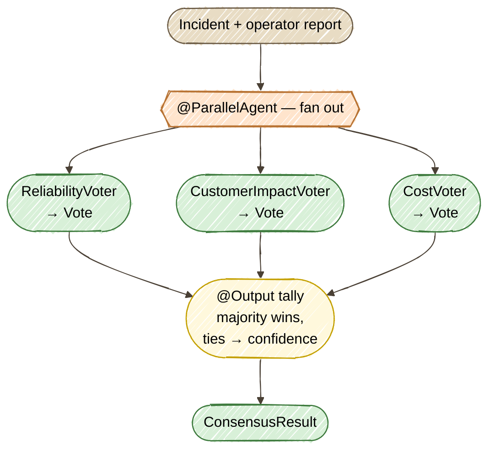

# Exercise 11 — Consensus & Voting

<span class="badge badge--code-along">Code-Along</span> <span class="badge" style="background:#1E5AA8;color:white;">Part 2 · Advanced</span>

**Timebox:** 20 minutes  
**Persona:** Jordan — Java platform engineer  
**You work in:** `solutions/11-consensus-voting/lab/`  
**Files to edit:**

- `src/.../agentic/agents/CostVoter.java`
- `src/.../agentic/workflow/ConsensusWorkflow.java`

!!! tip "Full solution"
    If stuck, the completed files are in [`solutions/11-consensus-voting/`](https://github.com/danieloh30/agentic-ai-java-workshop/tree/main/solutions/11-consensus-voting){:target="_blank"} — copy them over your TODO files and restart.

---

## Why Consensus & Voting?

A single agent gives you a single opinion — confident, fluent, and sometimes wrong in a way you can't see. For a high-stakes call like "what do we *do* about this incident right now?", one model's answer is a single point of failure.

**Consensus & Voting** hedges that risk the way an incident bridge does: ask several reviewers *with different priorities*, then go with the majority. Here, three persona agents — a **reliability** engineer, a **customer-impact** on-call, and a **cost/risk**-conscious platform engineer — each look at the same incident and vote for one action. Their disagreement is the feature: when all three converge you can act with confidence, and when they split you've surfaced a genuine trade-off instead of hiding it.

### Three moving parts

| Part | Who does it | Built with |
|------|-------------|------------|
| **Vote** | Three persona `@Agent`s, each returning a structured `Vote` (action + confidence + rationale) | declarative `@Agent` + a record return type (structured output, Exercise 8) |
| **Fan-out** | Run all three voters on the *same* incident, at once | `@ParallelAgent` (Exercise 3) |
| **Tally** | Count the ballots, pick the majority, break ties by confidence | an `@Output` method — plain, deterministic Java |



!!! note "Why a structured `Vote`, not free text?"
    Each voter returns a `Vote` **record** — `RecommendedAction action`, `int confidence`, `String rationale` — not a paragraph. That's what makes the tally *deterministic Java* instead of an LLM guessing a winner from three essays. The decision logic you can read, test, and trust; the model only supplies the ballots.

---

## Step 0 — Start the lab (2 min)

```bash
cd solutions/11-consensus-voting/lab
export OPENAI_API_KEY=sk-your-key-here
./mvnw quarkus:dev
```

Wait for PostgreSQL Dev Services to start. Open [http://localhost:8080](http://localhost:8080){:target="_blank"} — the incident dashboard from Part 1, same 8 seeded incidents.

!!! warning "Expect a red screen until *both* steps are done"
    The lab ships with two TODO files, and they're a unit. A declarative `@Agent` can only resolve its inputs when it's wired into a workflow that supplies them — so until the `@ParallelAgent` workflow exists (Step 2) *and* all three voters are real `@Agent`s (Step 1), dev mode shows a deployment error like *"No agent provides an output key named 'incidentInfo'"*. That's expected. Finish both steps and it boots green.

---

## Step 1 — Give the third voter a persona (7 min)

Open `CostVoter.java`. Two voters are written for you — `ReliabilityVoter` and `CustomerImpactVoter`. Read them: each is a declarative `@Agent` with a distinct **persona** in its `@SystemMessage`, and each returns a `Vote`.

Your job is the third perspective — **cost and operational risk**. Replace the TODO with the three annotations:

```java
    @SystemMessage("""
            You are a platform engineer voting on how to remediate an incident, weighing cost
            and operational risk. You are conservative: intrusive actions (ROLLBACK, RESTART)
            and permanent spend (SCALE_UP) all carry cost and risk, so you endorse them only
            when the evidence clearly justifies it. When the impact is limited or the cause is
            still unclear, you prefer MONITOR — the cheapest safe move — over acting blindly.

            Vote for exactly ONE action: ROLLBACK, SCALE_UP, RESTART, or MONITOR.
            Give a confidence from 0 to 100 and a single-sentence rationale.
            """)
    @UserMessage("""
            Incident: {incidentInfo.system}/{incidentInfo.service} (priority P{incidentInfo.priority})
            Description: {incidentInfo.description}
            Operator report: {report}

            Cast your vote.
            """)
    @Agent(description = "Votes on incident remediation from a cost / operational-risk perspective.",
           outputKey = "costVote")
    Vote vote(IncidentInfo incidentInfo, String report);
```

Add the imports:

```java
import dev.langchain4j.agentic.Agent;
import dev.langchain4j.service.SystemMessage;
import dev.langchain4j.service.UserMessage;
```

The `outputKey = "costVote"` is how this voter's ballot lands in the shared scope, where the tally will find it. The screen is still red — that's Step 2's job.

---

## Step 2 — Fan out and tally (8 min)

Open `ConsensusWorkflow.java`. This is the consensus itself: run the three voters in parallel, then count.

First, annotate `decide(...)` to fan out with `@ParallelAgent`:

```java
    @ParallelAgent(
            outputKey = "consensusResult",
            subAgents = {
                    ReliabilityVoter.class,
                    CustomerImpactVoter.class,
                    CostVoter.class
            })
    ConsensusResult decide(IncidentInfo incidentInfo, String report);
```

Then implement the `@Output` tally — read the three ballots from the scope, count them, and pick the winner (majority; ties broken by the higher summed confidence):

```java
    @Output
    static ConsensusResult tally(AgenticScope scope) {
        List<Vote> votes = new ArrayList<>();
        for (String key : List.of("reliabilityVote", "customerVote", "costVote")) {
            Vote v = scope.readState(key, (Vote) null);
            if (v != null) {
                votes.add(v);
            }
        }

        Map<RecommendedAction, Integer> counts = new EnumMap<>(RecommendedAction.class);
        Map<RecommendedAction, Integer> confidence = new EnumMap<>(RecommendedAction.class);
        for (Vote v : votes) {
            counts.merge(v.action(), 1, Integer::sum);
            confidence.merge(v.action(), v.confidence(), Integer::sum);
        }

        RecommendedAction winner = null;
        for (RecommendedAction action : counts.keySet()) {
            if (winner == null
                    || counts.get(action) > counts.get(winner)
                    || (counts.get(action).equals(counts.get(winner))
                        && confidence.get(action) > confidence.get(winner))) {
                winner = action;
            }
        }

        int agreement = winner == null ? 0 : counts.get(winner);
        boolean unanimous = !votes.isEmpty() && agreement == votes.size();
        return new ConsensusResult(winner, unanimous, agreement, votes.size(), votes);
    }
```

Add the imports:

```java
import java.util.ArrayList;
import java.util.EnumMap;
import java.util.List;
import java.util.Map;
import com.incidentmanagement.agentic.agents.ReliabilityVoter;
import com.incidentmanagement.agentic.agents.CustomerImpactVoter;
import com.incidentmanagement.agentic.agents.CostVoter;
import com.incidentmanagement.model.RecommendedAction;
import com.incidentmanagement.model.Vote;
import dev.langchain4j.agentic.declarative.Output;
import dev.langchain4j.agentic.declarative.ParallelAgent;
```

Save. The red screen clears and dev mode boots **green**.

!!! note "`@ParallelAgent` runs the voters concurrently"
    The three voters don't depend on each other, so `@ParallelAgent` runs them at the same time and each writes its `Vote` into the shared `AgenticScope` under its own `outputKey`. When all three are in, the `@Output` method runs once and turns the three ballots into a single `ConsensusResult`. Same fan-out pattern as Exercise 3 — here the "map" is a vote and the "reduce" is a tally.

---

## Step 3 — Run it and read the vote (3 min)

Everything comes back in one response. Start with the P1 — a clear regression:

```bash
curl -s -X POST "http://localhost:8080/incident-consensus/2" \
  -H "Content-Type: text/plain" \
  --data "Total login failure since 14:00; auth pods OOMKilled repeatedly after last deploy" | jq
```

All three voters see a post-deploy failure and converge — a **unanimous ROLLBACK**:

```json
{
  "decision": "ROLLBACK",
  "unanimous": true,
  "agreement": 3,
  "totalVoters": 3,
  "votes": [
    { "action": "ROLLBACK", "confidence": 95, "rationale": "...regression after the last deploy..." },
    { "action": "ROLLBACK", "confidence": 95, "rationale": "...began immediately after the deployment..." },
    { "action": "ROLLBACK", "confidence": 90, "rationale": "...rollback is the most prudent action..." }
  ]
}
```

Now a genuinely ambiguous one — a slow memory creep, no deploy, users barely affected:

```bash
curl -s -X POST "http://localhost:8080/incident-consensus/5" \
  -H "Content-Type: text/plain" \
  --data "Heap slowly climbing over 6h on one of three pods; that pod self-restarted once. No recent deploy, root cause unknown. Users mostly unaffected, rare timeouts." \
  | jq '{decision, unanimous, agreement} + {ballots: [.votes[] | {action, confidence}]}'
```

This time the voters **split** — and the tally earns its keep:

```json
{
  "decision": "RESTART",
  "unanimous": false,
  "agreement": 2,
  "ballots": [
    { "action": "RESTART", "confidence": 85 },
    { "action": "RESTART", "confidence": 85 },
    { "action": "MONITOR", "confidence": 85 }
  ]
}
```

Two voters want a RESTART, the cost-conscious one wants to wait — majority carries it, and `unanimous: false` tells you honestly that it was a judgment call. That's the whole point: the disagreement is visible, not averaged away.

The **dashboard** works too: open an incident and click **Process Incident** — it runs the same vote and shows the decision plus every ballot.

---

## What you learned

- **Consensus & Voting** turns one model's opinion into a decision backed by several — and surfaces disagreement instead of hiding it behind a single confident answer.
- **Persona `@Agent`s** give you cheap diversity: same model, different `@SystemMessage`, genuinely different priorities on the ballot.
- **`@ParallelAgent`** fans the same input out to independent agents concurrently, each writing to the shared scope — the map half of map/reduce.
- **A deterministic `@Output` tally** is the reduce half: because each vote is a structured `Vote` record, the winner is chosen by code you can read and test, not by an LLM.

??? tip "Stretch goals"
    - Add a fourth voter (e.g. a *security* persona) — one new `@Agent` class plus one line in `subAgents`, and the tally already handles it.
    - Weight the vote by confidence instead of a plain count, and see which incidents change outcome.
    - Add a tie-break agent: when `unanimous` is false, feed the split ballots to a synthesis agent that writes the final call — voting *then* deliberation.

Next: **Exercise 12 — Event-Driven Agents**, the capstone, where agents are triggered by Kafka events instead of HTTP calls. *(coming next in Part 2)*
