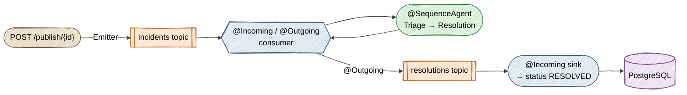

# Exercise 12 — Event-Driven Agents (Capstone)

<span class="badge badge--code-along">Code-Along</span> <span class="badge" style="background:#1E5AA8;color:white;">Part 2 · Capstone</span>

**Timebox:** 20 minutes  
**Persona:** Jordan — Java platform engineer  
**You work in:** `solutions/12-event-driven/lab/`  
**Files to edit:**

- `src/.../agentic/workflow/IncidentResolutionWorkflow.java`
- `src/.../messaging/IncidentEventConsumer.java`

!!! tip "Full solution"
    If stuck, the completed files are in [`solutions/12-event-driven/`](https://github.com/danieloh30/agentic-ai-java-workshop/tree/main/solutions/12-event-driven){:target="_blank"} — copy them over your TODO files and restart.

---

## Why event-driven agents?

Every exercise so far triggered an agent with an **HTTP call** — you `POST`ed and waited for the answer. That's fine for a demo, but production incidents don't arrive as polite synchronous requests. They arrive as a *stream*: alerts fired by monitoring, events pushed onto a bus, faster than any human can click. And you don't want the alert source blocked while an LLM thinks for six seconds.

The capstone rewires the pipeline around **messaging**. An incident lands as an event on a Kafka topic; a consumer picks it up, runs the agentic pipeline, and publishes the resolution to a *second* topic — where a downstream sink consumes it and updates the database. The producer never waits for the agent. This is how you put agents into a real event-driven system: **agents as stream processors**.

### The pipeline

| Stage | Who does it | Built with |
|-------|-------------|------------|
| **Publish** | Turn a DB incident into an `IncidentEvent`, drop it on the bus | `@Channel` + `Emitter` (SmallRye Reactive Messaging) |
| **Consume + run** | Read the event, run triage→resolution, publish the result | `@Incoming`/`@Outgoing` + `@Blocking` |
| **The agent work** | Triage the incident, then decide the fix | `@SequenceAgent` over two `@Agent`s (Exercise 2) |
| **Sink** | Read the resolution, mark the incident RESOLVED | `@Incoming` + `@Transactional` |



!!! note "No Kafka to install — Dev Services provides it"
    The lab depends on `quarkus-messaging-kafka`. In dev mode, Quarkus **Dev Services** automatically starts a [Redpanda](https://redpanda.com/){:target="_blank"} broker (a Kafka-compatible engine) in a container and points the app at it — nothing to configure. You just need Docker or Podman running, the same as the PostgreSQL you've used all workshop.

---

## Step 0 — Start the lab (2 min)

```bash
cd solutions/12-event-driven/lab
export OPENAI_API_KEY=sk-your-key-here
./mvnw quarkus:dev
```

First launch is a little slower — Dev Services pulls both a PostgreSQL and a Redpanda image. Watch the log for the Kafka broker starting, then open [http://localhost:8080](http://localhost:8080){:target="_blank"}.

!!! warning "Expect a red screen until *both* steps are done"
    As in Exercise 11, the two TODO files are a unit. The `@SequenceAgent` workflow (Step 1) is what supplies the `@Agent`s their inputs, and the consumer (Step 2) is what actually runs the workflow. Until both are wired, dev mode shows a deployment error. Finish both and it boots green.

---

## Step 1 — Wire the agentic pipeline (7 min)

Open `IncidentResolutionWorkflow.java`. Two agents already exist:

- **`TriageAgent`** (`outputKey = "triage"`) — classifies the incident: category, severity, the next signal to check.
- **`ResolutionAgent`** (`outputKey = "resolution"`) — takes the incident **and** the triage, and decides the fix (starting with an action verb: ROLLBACK / SCALE_UP / RESTART / MONITOR).

Notice `ResolutionAgent.resolve(IncidentEvent, String triage)` takes `triage` as an explicit parameter — the `@SequenceAgent` binds it by name from the shared scope, exactly the sequencing pattern from Exercise 2.

Chain them with `@SequenceAgent`:

```java
    @SequenceAgent(
            outputKey = "resolutionResult",
            subAgents = { TriageAgent.class, ResolutionAgent.class })
    ResolutionEvent process(IncidentEvent incidentEvent);
```

Then implement the `@Output` — assemble the final `ResolutionEvent` from the scope:

```java
    @Output
    static ResolutionEvent output(AgenticScope scope) {
        IncidentEvent incident = scope.readState("incidentEvent", (IncidentEvent) null);
        String triage = scope.readState("triage", "");
        String resolution = scope.readState("resolution", "");
        return new ResolutionEvent(incident.incidentId(), triage, resolution);
    }
```

Add the imports:

```java
import com.incidentmanagement.agentic.agents.TriageAgent;
import com.incidentmanagement.agentic.agents.ResolutionAgent;
import com.incidentmanagement.model.IncidentEvent;
import com.incidentmanagement.model.ResolutionEvent;
import dev.langchain4j.agentic.declarative.Output;
import dev.langchain4j.agentic.declarative.SequenceAgent;
```

Still red — the workflow exists, but nothing runs it yet. That's Step 2.

---

## Step 2 — Turn the consumer into a stream processor (8 min)

Open `IncidentEventConsumer.java`. The workflow is already injected. Your job is to make one method both **consume** incidents and **produce** resolutions.

Replace the TODO body and add the three messaging annotations:

```java
    @Incoming("incidents-in")
    @Outgoing("resolutions-out")
    @Blocking
    public ResolutionEvent process(IncidentEvent event) {
        Log.infof("Processing incident %d from Kafka", event.incidentId());
        return workflow.process(event);
    }
```

Add the imports:

```java
import org.eclipse.microprofile.reactive.messaging.Incoming;
import org.eclipse.microprofile.reactive.messaging.Outgoing;
import io.smallrye.reactive.messaging.annotations.Blocking;
import io.quarkus.logging.Log;
```

That's the whole event loop:

- **`@Incoming("incidents-in")`** — Quarkus subscribes this method to the incidents topic and calls it for every event. It auto-generates a Jackson deserializer for the `IncidentEvent` record.
- **`@Outgoing("resolutions-out")`** — whatever you `return` is serialized and published to the resolutions topic.
- **`@Blocking`** — the LLM call takes seconds, so this runs on a worker thread instead of blocking the reactive event loop.

Save. The red screen clears and dev mode boots **green**.

!!! note "Channels vs. topics"
    `incidents-in` and `resolutions-out` are *channel* names — logical wires inside the app. `application.properties` maps each channel to a real Kafka topic (e.g. `mp.messaging.incoming.incidents-in.topic=incidents-in`). The REST resource's emitter, this consumer, and the downstream sink are three separate channels stitched onto two topics. Open `application.properties` to see the full wiring.

---

## Step 3 — Publish an event and watch it resolve (3 min)

The flow is asynchronous, so you **publish**, then **poll** for the resolution — you don't get it back in the POST response.

Fire an incident onto the bus:

```bash
curl -s -X POST "http://localhost:8080/incident-events/publish/2" \
  -H "Content-Type: text/plain" \
  --data "Total login failure since 14:00; auth pods OOMKilled after last deploy" | jq
```

```json
{ "incidentId": 2, "status": "published to pipeline" }
```

In the dev-mode log you'll see the consumer pick it up and the `@SequenceAgent` run. After a few seconds, poll for the resolution:

```bash
curl -s "http://localhost:8080/incident-events/resolutions/2" | jq
```

```json
{
  "incidentId": 2,
  "triage": "Category: Configuration / Severity: Critical / Next signal: recent deploy diff",
  "resolution": "ROLLBACK the last deployment immediately; the OOMKills began right after it ..."
}
```

The whole round trip — publish → Redpanda → consumer → triage → resolution → resolutions topic → sink — takes about **6 seconds**. The sink also flips the incident to **RESOLVED** in PostgreSQL: refresh the dashboard, or

```bash
curl -s "http://localhost:8080/incidents" | jq '.[] | select(.id==2) | {id, status}'
```

```json
{ "id": 2, "status": "RESOLVED" }
```

Try `GET /incident-events/resolutions` (no id) to see every resolution the pipeline has produced this session.

!!! tip "If the first poll 404s"
    That just means the pipeline hasn't finished yet — it's asynchronous. Wait a second and poll again. That 404-then-200 *is* the event-driven behavior: the producer never blocked on the agent.

---

## What you learned — and the whole workshop

- **Agents as stream processors.** An `@Incoming`/`@Outgoing` method turns your agentic pipeline into a Kafka consumer that reads events and publishes results — decoupled from whoever produced the event.
- **`@Blocking`** keeps slow LLM calls off the reactive event loop, so the broker and the rest of the app stay responsive.
- **Dev Services** gave you a real Kafka broker (Redpanda) with zero configuration — the same frictionless loop you've had for PostgreSQL all workshop.
- **The agentic patterns compose.** The `@SequenceAgent` here is the same primitive from Part 1; the capstone just changed its *trigger* from HTTP to an event and its *output* from a response body to another topic.

You've now gone from a single agent with one tool (Exercise 1) to a **fully event-driven, multi-stage agentic system** running on Quarkus — planning, memory, consensus, and streaming included. That's the arc of the workshop.

??? tip "Stretch goals"
    - Add a **dead-letter** path: when resolution fails, `@Outgoing` to a `failures` topic instead, and consume it with a retry sink.
    - Publish the *consensus* vote from Exercise 11 as the resolution decision — swap the `@SequenceAgent` for the `@ParallelAgent` voting workflow behind the same consumer.
    - Emit an event per *stage* (triaged, resolved) so a UI can show live progress as the pipeline runs.

🎉 **That's the capstone — you've completed the workshop.** Head back to the [Home page](../index.md) for the full exercise map, or revisit any pattern in `solutions/`.
