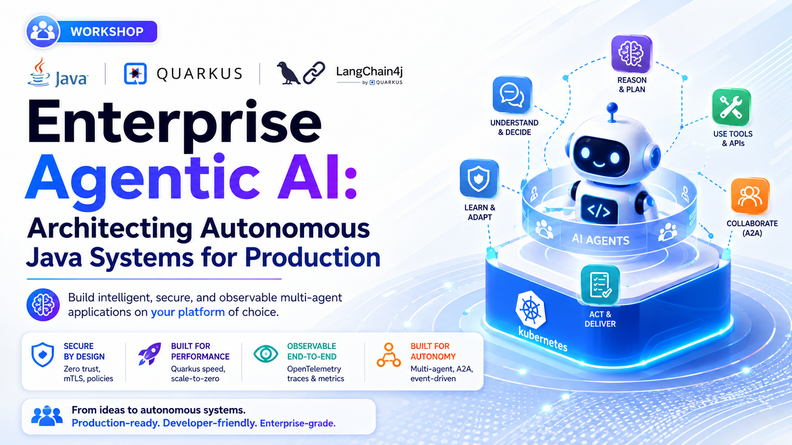
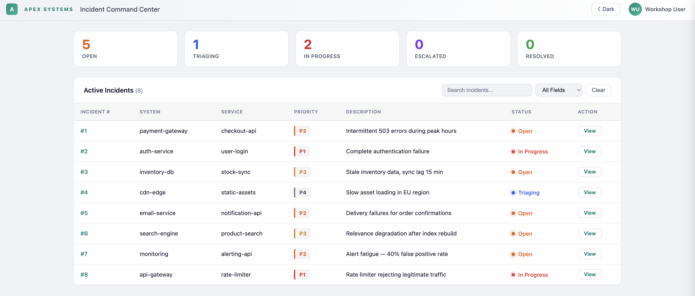

# Enterprise Agentic AI: Architecting Autonomous Java Systems for Production

**Hands-On Workshop · 90 min**

!!! tip "Quick access"
    Short URL for this guide: **[bit.ly/agents-labs](https://bit.ly/agents-labs){:target="_blank"}** — share it or bookmark it.

Build intelligent, secure, and observable multi-agent applications on **Quarkus** — from a single agent to a full supervisor orchestration with human-in-the-loop, OpenTelemetry tracing, and A2A remote agents.

## Prerequisites

Confirm these before the workshop starts:

| Requirement | Check |
|-------------|-------|
| **Java 25+** | `java -version` |
| Maven 3.9+ | or use `./mvnw` in each exercise |
| Quarkus | `./mvnw quarkus:dev` |
| [OpenCode CLI](https://opencode.ai/){:target="_blank"} or any AGENTS.md-compatible AI assistant | Install and configure before the workshop |
| LLM API key | `OPENAI_API_KEY` (OpenAI, Anthropic, or compatible provider) |
| Free ports **8080**, **8888** | One process per exercise set |
| Docker or Podman | For Quarkus Dev Services (PostgreSQL, LGTM) |

## Get the code

```bash
git clone https://github.com/danieloh30/agentic-ai-java-workshop.git
cd agentic-ai-java-workshop
export OPENAI_API_KEY=sk-your-key-here

# Your working project — start here for Exercise 1
cd lab
./mvnw quarkus:dev
```

Open [http://localhost:8080](http://localhost:8080){:target="_blank"} — Incident Dashboard with 8 seeded incidents and status cards.
No agent behavior yet: that's Exercise 1.



!!! tip "Reference solutions"
    Solutions live in `solutions/`. Each exercise guide links to its solution at the top — use them only if you get stuck.

## Exercises

| Exercise | Time | Focus |
|----------|------|-------|
| [1. Agent + tool](01-first-agent/START_HERE.md) | 15 min | `TriageAgent` + `TriageTool` |
| [2. Policy as prompt](02-maintenance-agent/START_HERE.md) | 10 min | `DiagnosticAgent` + `@SystemMessage` as policy |
| [3. Parallel agents](03-parallel-workflow/START_HERE.md) | 10 min | `@ParallelMapperAgent` + `@Output` |
| [4. Supervisor orchestration](04-supervisor/START_HERE.md) | 15 min | Full multi-agent supervisor |
| [5. AI governance](05-ai-governance/START_HERE.md) | 10 min | `AGENTS.md` + OpenCode CLI |
| [6. Human gate + tracing](06-hitl-observability/START_HERE.md) | 10 min | Human-in-the-loop + OpenTelemetry |
| [7. Remote agents (A2A)](07-a2a/START_HERE.md) | 10 min | Distributed impact assessment agent |
| [8. Quality loop (bonus)](08-quarkus-flow/START_HERE.md) | 15 min | Programmatic loop with `AgenticServices.loopBuilder()` |

Start with the **[Lab Overview](00-intro/SPEAKER_NOTES.md)** to understand the scenario, architecture, and learning path.

## Repository layout

| Path | Purpose |
|------|---------|
| `lab/` | Your hands-on Quarkus project (stub files with `// TODO`) |
| `AGENTS.md` | Project context file for AI assistants — rules, agent inventory, and conventions loaded once to avoid repeated file scans |
| `docs/` | These lab instructions (this site) |
| `solutions/` | Reference solution projects for each exercise — copy files from here if you get stuck |
| `solutions/08-quarkus-flow/lab/` | Separate starter project for the bonus exercise (not the root `lab/`) |
